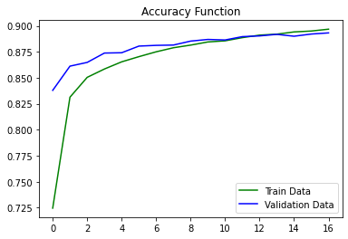

# Multi-Layer Perceptron on Fashion MNIST Dataset

[Dataset on kaggle](https://www.kaggle.com/datasets/zalando-research/fashionmnist)

## Contents
### Data Cleaning
Reading the dataset and splitting target and input

### Data Preprocessing
* Scaling
* Encoding

### Modeling
Here we use a multi-layer perceptron with 2 hidden layers
* Callbacks: early stopping
* Input layer: 300 units with relu activation and 0.3 dropout
* Hidden layers: 2 hidden layers with relu activation, first layer has 50 units with 0.2 dropout and second layer has 10 units
* Output layer: 10 units with softmax activation
* Optimizer: adam
* Loss: categorical cross entropy
* Metric: categorical accuracy

### Evaluation
